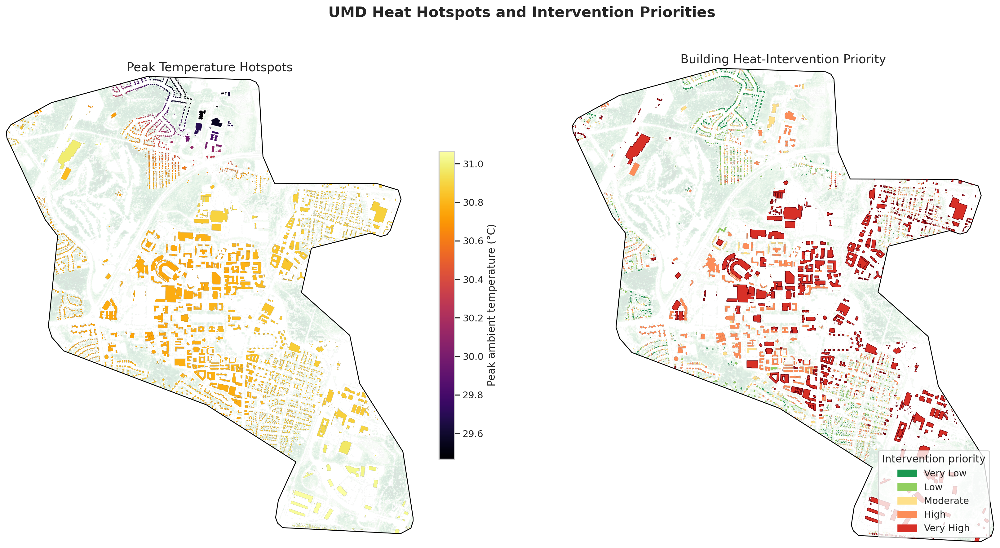
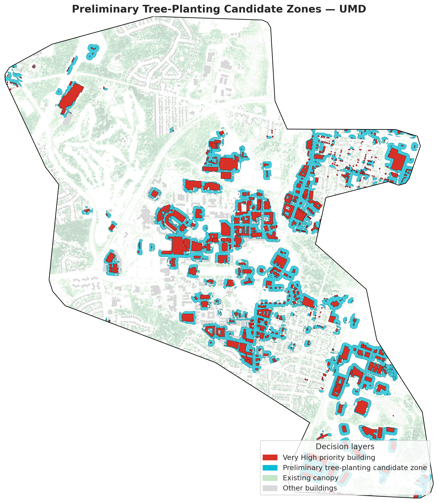
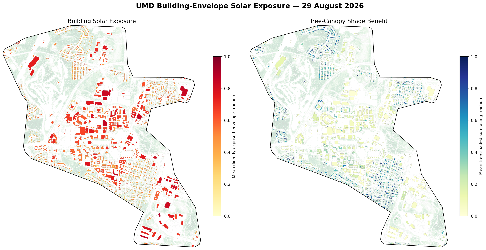
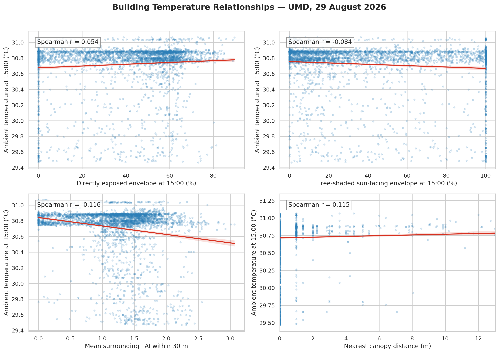

<div align="center">

# Urban Heat Decision Intelligence

### From temperature detection to building-level heat diagnosis and cooling priorities

**FortyGuard Hackathon '26 · University of Maryland, College Park Pilot**

<!-- Replace LIVE_DASHBOARD_URL and DEMO_VIDEO_URL with the final public links before publishing. -->

[**Live Dashboard**]([LIVE_DASHBOARD_URL](https://urban-heat-decision-intelligence.onrender.com)) · [**Three-minute Demo Video**](DEMO_VIDEO_URL)

[](https://github.com/hayatkhan20/umd-urban-heat-exposure)
[](https://colab.research.google.com/github/hayatkhan20/umd-urban-heat-exposure/blob/main/notebooks/01_umd_analysis_boundary.ipynb)

</div>

> **Urban Heat Decision Intelligence** transforms temperature maps into building-level explanations and prioritized cooling actions. Using the University of Maryland, College Park as a pilot, the workflow connects FortyGuard temperature data with vegetation, canopy height, building geometry, tree proximity and solar exposure.

<p align="center">
  
</p>

---

## Problem and solution

FortyGuard provides hyperlocal temperature intelligence that helps identify **where temperature is elevated**. A temperature hotspot, however, does not by itself explain why nearby buildings may experience different levels of heat exposure or where limited cooling resources should be directed first.

This workflow adds the physical and environmental context needed for that next decision. It investigates:

- which buildings are most exposed;
- how building geometry and direct solar exposure vary across the study area;
- how surrounding vegetation, canopy height, tree proximity and LAI relate to those buildings; and
- where cooling interventions should be screened first.

The final outputs are designed to move from **heat detection → heat diagnosis → intervention screening** by producing:

- building-level heat and exposure profiles;
- relative heat-intervention priority classes; and
- preliminary tree-planting candidate zones near the highest-priority eligible buildings.

The project does **not** treat the environmental relationships as proof of causation. Instead, it combines transparent spatial evidence into a reproducible decision-support workflow.

---

## Study area

The pilot study area is the **University of Maryland, College Park**, in Maryland, USA.

| Study-area attribute | Value |
| --- | --- |
| Pilot location | University of Maryland, College Park |
| Analysis area | **10.945 km²** |
| Primary analysis CRS | EPSG:26918 |
| Primary heat-analysis date | 29 August 2026 |

The workflow is designed to be transferable: another campus, neighborhood or city can be analyzed by replacing the study boundary and using locally appropriate building, vegetation, canopy and temperature inputs.

This implementation is currently **US-focused** because FortyGuard coverage and the NAIP-derived canopy-height inputs used here are US-based. The analytical logic itself is not tied to UMD.

---

## Workflow

```text
Boundary
   ↓
Leaf Area Index (LAI)
   ↓
Buildings and heights
   ↓
Canopy height
   ↓
Canopy distance
   ↓
Solar exposure
   ↓
FortyGuard temperatures
   ↓
Relationships
   ↓
Intervention priorities
```

In compact form:

**Boundary → LAI → Buildings and heights → Canopy height → Canopy distance → Solar exposure → FortyGuard temperatures → Relationships → Intervention priorities**

### What happens at each stage

1. **Boundary** — define and project the UMD pilot analysis area.
2. **LAI** — estimate summer vegetation density from Sentinel-2 imagery.
3. **Buildings and heights** — assemble building footprints and usable 3D height attributes from Overture data and derived estimates.
4. **Canopy height** — create a filtered canopy-height surface from the NAIP-based canopy-height model.
5. **Canopy distance** — measure how close each building is to surrounding canopy.
6. **Solar exposure** — calculate changing roof and façade exposure using building height, canopy height, directional distance and solar geometry.
7. **FortyGuard temperatures** — retrieve 60 m temperature estimates at 09:00, 12:00, 15:00 and 18:00 on 29 August 2026.
8. **Relationships** — compare temperature with exposure, tree shade, surrounding LAI and canopy distance.
9. **Intervention priorities** — combine heat and environmental deficits into relative building priorities, then screen nearby planting opportunities.

---

## Key results

| Result | Value |
| --- | ---: |
| Analysis area | **10.945 km²** |
| Buildings profiled | **3,694** |
| FortyGuard temperature records | **12,088** |
| Temperature observations | **09:00, 12:00, 15:00, 18:00** |
| Mean summer LAI | **1.281** |
| Estimated canopy cover | **41.22%** |
| Mean canopy height | **13.77 m** |
| Four-time direct envelope exposure | **53.39%** |
| Buildings with all four temperatures | **3,694** |
| Relative Very High priority buildings | **739** |
| Very High buildings eligible for planting screening | **638** |
| Preliminary planting zones | **308** |
| Candidate-zone area | **1.254 km²** |

### Why 739 and 638 are different

**739 buildings** fall in the **Very High** priority class, which is the highest-priority quintile of the analyzed building population.

The planting workflow then applies an additional **≥25 m² building-footprint criterion**. After that eligibility screen, **638 Very High priority buildings** remain as source buildings for nearby planting-zone analysis.

Therefore:

- **739** = all Very High priority buildings;
- **638** = Very High priority buildings that pass the footprint criterion for planting screening.

These counts should not be used interchangeably.

---

## Results gallery

### 1. Building heat-intervention priority

The priority layer ranks buildings **relative to other buildings in the UMD study area** using heat, solar exposure and vegetation-related evidence.

<p align="center">
  
</p>

### 2. Preliminary tree-planting candidate zones

Candidate areas are generated near eligible Very High priority buildings to narrow where field teams should investigate planting feasibility first.

<p align="center">
  
</p>

### 3. Building-envelope solar exposure

Solar exposure is evaluated across the building envelope rather than treating roofs as the only exposed surface.

<p align="center">
  
</p>

---

## Methodology

### 1. Analysis boundary

The UMD boundary defines the spatial extent for all subsequent raster and vector processing. Projected calculations are performed in **EPSG:26918**.

### 2. Sentinel-2 Leaf Area Index

Summer LAI is estimated from Sentinel-2 Level-2A surface-reflectance imagery.

Key choices include:

- dataset: `COPERNICUS/S2_SR_HARMONIZED`;
- period: **1 July–29 August 2026**;
- Sentinel-2 Scene Classification Layer cloud filtering;
- median compositing of valid observations;
- ESA/SNAP Sentinel-2 biophysical neural-network LAI model;
- native analysis resolution: **20 m**; and
- clear non-vegetated pixels represented as LAI = 0.

LAI is used as an indicator of surrounding vegetation density, not as a direct measurement of cooling energy.

### 3. Buildings and heights

Building footprints come from the **Overture Maps 2026-08-19.0 release**. Height information is completed from available building attributes and derived estimates so that each analyzed building can participate in the 3D exposure workflow.

A total of **3,694 buildings** are profiled.

### 4. Canopy height and proximity

The canopy-height baseline is primarily derived from **2021–2023 NAIP imagery**, so it should not be interpreted as a complete 2026 tree inventory.

The workflow calculates:

- canopy height;
- existing canopy coverage; and
- building-to-canopy proximity.

These variables provide physical context for potential shade around each building.

### 5. Solar exposure

Solar geometry is calculated for **29 August 2026** at the same four analysis times used for the FortyGuard temperature observations.

For directional tree shading, the simplified physical test is:

Canopy shades the target surface when:

$$
H_c > H_b + d\tan(\theta)
$$

where:

- `Hc` = canopy height;
- `Hb` = building height;
- `d` = directional distance from canopy to the building surface; and
- `θ` = solar elevation.

The exposure workflow evaluates changing shade and direct sun across **roofs and sun-facing façades**. The four-time direct building-envelope exposure is **53.39%**.

### 6. FortyGuard temperature intelligence

FortyGuard temperature estimates are requested at **60 m granularity** for:

- 09:00;
- 12:00;
- 15:00; and
- 18:00

on **29 August 2026**.

The four calls produce **12,088 temperature records**, and all **3,694 buildings** receive temperature values at all four observation times.

The public dashboard uses cached analytical outputs and does not expose a FortyGuard API key.

### 7. Relative intervention priority

The decision layer combines indicators including:

- peak temperature;
- solar exposure;
- tree-shade deficit; and
- LAI deficit.

Priority classes are **relative quintiles within the UMD study area**. They are designed to rank where intervention assessment should begin, not to define absolute heat-danger thresholds.

---

## Relationship analysis

The project also examines descriptive relationships between FortyGuard temperature and the finer-scale environmental variables. These graphs are intentionally presented below the primary intervention outputs because the measured relationships are relatively weak.

<p align="center">
  
</p>

At 15:00, the Spearman relationships are approximately:

| Variable vs. temperature | Spearman ρ | Observed direction |
| --- | ---: | --- |
| Solar exposure | 0.054 | More exposure trends warmer |
| Tree shade | -0.084 | More tree shade trends cooler |
| Surrounding LAI | -0.116 | More vegetation trends cooler |
| Canopy distance | 0.115 | Larger canopy gaps trend warmer |

These coefficients are **weak associations**. They are useful as descriptive evidence and directional context, but they do **not** establish that any individual variable causes the observed temperature differences.

---

## Data provenance

The project intentionally combines datasets from different observation periods. This table is important for interpreting the results correctly.

| Layer | Source / period |
| --- | --- |
| Analysis boundary | Maryland Open Data |
| Sentinel-2 LAI | **1 July–29 August 2026** |
| Overture buildings | **Release 2026-08-19.0** |
| Canopy-height baseline | **Primarily 2021–2023 NAIP imagery** |
| Solar positions | **29 August 2026** |
| FortyGuard temperatures | **29 August 2026** |

> **Important:** not every input represents 2026 ground conditions. In particular, the canopy-height baseline is older than the FortyGuard temperature and solar-analysis date.

---

## Interpretation and limitations

The outputs should be interpreted as a **decision-support and screening workflow**, not as a causal urban-climate model or engineering design.

- Reported relationships are **associations, not proof of causation**.
- Priority classes are **relative quintiles within the study area**.
- **Very High** means the highest 20% of analyzed buildings; it is **not an absolute danger classification**.
- FortyGuard values are **60 m ambient-temperature estimates**, not measured roof or wall surface temperatures.
- The analysis represents one hot summer day, **29 August 2026**, while the LAI composite covers the preceding summer period.
- The canopy-height baseline primarily represents **2021–2023 NAIP imagery**, so individual trees may have changed since image acquisition.
- Planting zones are **preliminary screening areas**, not confirmed planting sites.
- Final planting decisions require field checks for **roads, pavement, utilities, land ownership, accessibility, conflicts with infrastructure and planting feasibility**.
- Additional dates, field observations and validation data would strengthen future analysis.

---

## Reproducible notebooks

Run the notebooks in numerical order.

| Step | Notebook | Purpose | Colab |
| --- | --- | --- | --- |
| 01 | [`01_umd_analysis_boundary.ipynb`](notebooks/01_umd_analysis_boundary.ipynb) | Prepare the UMD analysis boundary | [Open](https://colab.research.google.com/github/hayatkhan20/umd-urban-heat-exposure/blob/main/notebooks/01_umd_analysis_boundary.ipynb) |
| 02 | [`02_leaf_area_index.ipynb`](notebooks/02_leaf_area_index.ipynb) | Estimate summer Sentinel-2 LAI | [Open](https://colab.research.google.com/github/hayatkhan20/umd-urban-heat-exposure/blob/main/notebooks/02_leaf_area_index.ipynb) |
| 03 | [`03_overture_building_heights.ipynb`](notebooks/03_overture_building_heights.ipynb) | Build the building geometry and height dataset | [Open](https://colab.research.google.com/github/hayatkhan20/umd-urban-heat-exposure/blob/main/notebooks/03_overture_building_heights.ipynb) |
| 04 | [`04_canopy_height.ipynb`](notebooks/04_canopy_height.ipynb) | Derive canopy height and canopy context | [Open](https://colab.research.google.com/github/hayatkhan20/umd-urban-heat-exposure/blob/main/notebooks/04_canopy_height.ipynb) |
| 05 | [`05_sun_shadow_exposure.ipynb`](notebooks/05_sun_shadow_exposure.ipynb) | Model sun, shade and building-envelope exposure | [Open](https://colab.research.google.com/github/hayatkhan20/umd-urban-heat-exposure/blob/main/notebooks/05_sun_shadow_exposure.ipynb) |
| 06 | [`06_fortyguard_heat_priority.ipynb`](notebooks/06_fortyguard_heat_priority.ipynb) | Add FortyGuard temperature, relationships, priorities and planting screening | [Open](https://colab.research.google.com/github/hayatkhan20/umd-urban-heat-exposure/blob/main/notebooks/06_fortyguard_heat_priority.ipynb) |

---

## Repository structure

```text
umd-urban-heat-exposure/
├── data/                  # Study inputs and processed analytical layers
├── notebooks/             # Reproducible analysis notebooks 01–06
├── outputs/
│   └── figures/           # Final maps and relationship graphics
├── webapp/                # Interactive React dashboard
├── .gitignore
├── LICENSE
└── README.md
```

---

## Interactive dashboard

The `webapp/` directory contains the project dashboard for exploring the analytical outputs interactively. It includes:

- temperature views for the four observation times;
- solar-exposure mapping;
- building heat-priority mapping;
- preliminary planting-screening zones;
- building and candidate-zone popups; and
- summary charts and result figures.

The public application works from prepared/cached outputs so that the FortyGuard API key is not exposed in the browser.

[**Open the live dashboard**](https://urban-heat-decision-intelligence.onrender.com)

[**Watch the three-minute demo video**](https://www.youtube.com/watch?v=KkWTb22GhjU)

---

## What this project demonstrates

FortyGuard already answers an essential first question: **where is it hot?**

This project explores the next layer of decision intelligence:

> **Which buildings are exposed, what physical conditions surround them, and where should cooling interventions be investigated first?**

The UMD pilot demonstrates a reproducible path from temperature intelligence to transparent, building-level intervention screening using geospatial analysis, remote sensing, 3D urban geometry and solar physics.

---

## License

This repository is released under the [MIT License](LICENSE).

---

<div align="center">

**FortyGuard Hackathon '26 · Urban Heat Decision Intelligence · UMD College Park Pilot**

</div>
